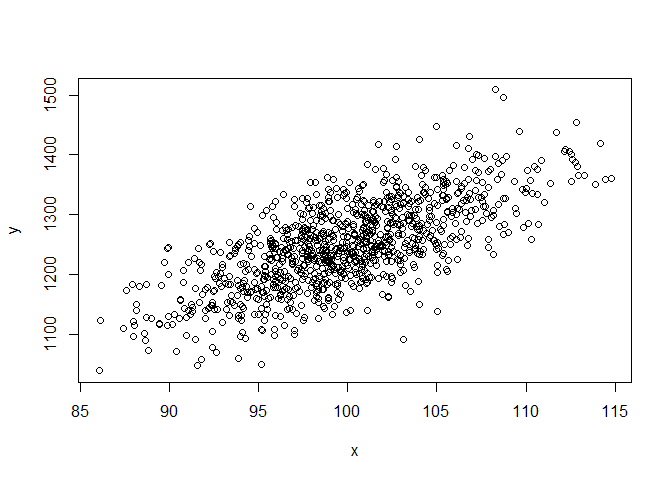
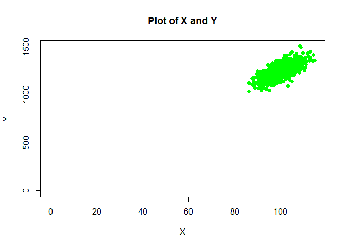
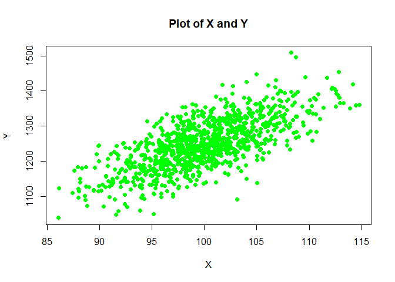

Summary Statistics and Correlations
================

This example shows how to calculate basic summary statistics for two
variables, as well as the correlation between them, using R. We also
visualize the points with a scatterplot.

First, we generate 1000 observations of randomly distributed data. (This
is the same formula I use to generate data for the regression analysis
example).

``` r
x<-rnorm(1000,mean=100,sd=5)
head(x)
```

    ## [1]  97.89063  95.94018  95.80639  93.63276 100.95362 102.86364

We then generate 1000 observations for *Y* based on *Y = 250 + 10X + e*
. I bind the columns into a new dataset.

``` r
y<-250+10*x+rnorm(1000,mean=0,sd=50)
data<-cbind(x,y)
```

## Summary Statistics

Our main summary statistics are the mean and standard deviation. I
usually include the minimum and maximum values, as well as the median.

R has a *summary()* command, but it does not give the standard
deviation:

``` r
summary(data)
```

    ##        x                y       
    ##  Min.   : 86.05   Min.   :1039  
    ##  1st Qu.: 96.62   1st Qu.:1201  
    ##  Median : 99.76   Median :1247  
    ##  Mean   : 99.90   Mean   :1249  
    ##  3rd Qu.:102.96   3rd Qu.:1299  
    ##  Max.   :114.78   Max.   :1509

Here, I use *colMeans()* for each column. If you wanted to, you could do
*rowMeans*.

``` r
means<-colMeans(data)
means
```

    ##          x          y 
    ##   99.89802 1249.14586

For the rest, we can use the *apply()* function. Note that “column” is
“2” if you think of *(row, column)*

``` r
sds<-apply(data,2,FUN="sd")
sds
```

    ##         x         y 
    ##  4.971584 72.017927

We can do the same for median, min, and max:

``` r
mins<-apply(data,2,FUN="min")
meds<-apply(data,2,FUN="median")
maxes<-apply(data,2,FUN="max")
```

Although if you want, you can extract it from the *summary()* table and
get the same numbers. But those are rounded too much:

``` r
meds
```

    ##          x          y 
    ##   99.76158 1246.87786

``` r
summary(data)[3,]
```

    ##                  x                  y 
    ## "Median : 99.76  "   "Median :1247  "

We can make a nice table by binding the rows and then assigning (better)
names to the columns. We also want to round to three decimal places:

``` r
table<-rbind(means,sds,mins,meds,maxes)
rownames(table)<-c("Mean","SD","Min","Med","Max")
round(table,3)
```

    ##            x        y
    ## Mean  99.898 1249.146
    ## SD     4.972   72.018
    ## Min   86.052 1038.913
    ## Med   99.762 1246.878
    ## Max  114.776 1508.687

## Correlations

Next, we calculate the correlation between *x* and *y*:

``` r
round(cor(x,y),3)
```

    ## [1] 0.702

The variables were designed to be highly correlated–and they are.

I often use the nonparametric Spearman correlation; I expect this to be
close to the calculated (default) Pearson value we just did.

``` r
round(cor(x,y,method = "spearman"),3)
```

    ## [1] 0.677

## Visualizing the Data

We can make a scatterplot of the two variables:

``` r
plot(x,y)
```

<!-- -->

The default settings aren’t very pretty, so we customize the point style
(*pch*), size (*cex*), and color. I also relabel the axes slightly and
give the graph a title. You can also make the graph cover (0,0) with
*xlim* and *ylim* if you want (but you can see why you may not want
to!).

``` r
plot(x,y,xlim=c(0,max(x)),ylim=c(0,max(y)),pch=20,cex=1.5, col="green", xlab="X",ylab="Y",main ="Plot of X and Y")
```

<!-- -->

So we go back to the default rage. I also use a hex code to get green
this time:

``` r
plot(x,y,pch=20,cex=1.5, col="#00FF00", xlab="X",ylab="Y",main ="Plot of X and Y")
```

<!-- -->

You will, of course, need to look up code for the customizations you
want to make, such as different shapes and colors. Line graphs have
their own issues. I work these in to other examples in my courses. In
addition, you may wish to learn *ggplot*, but here (and in my own work)
I just use base R.
