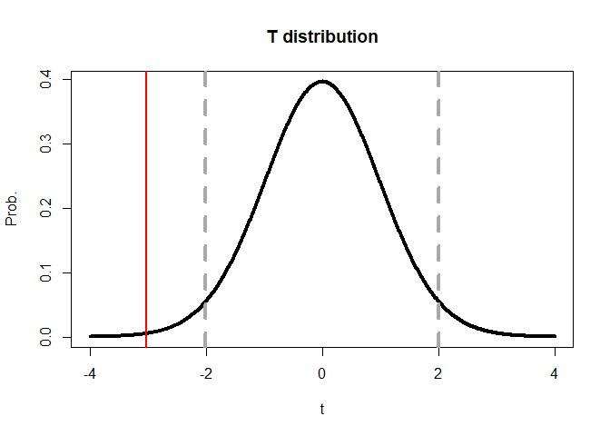
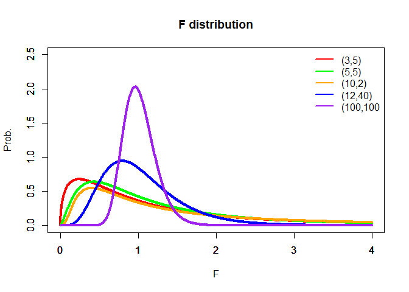
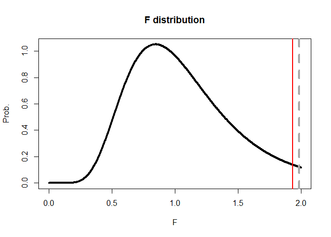

Distributions and Hypothesis Testing
================

ECON 346, NEIU (Scott W. Hegerty)

A *statistical distribution* shows the possible outcomes of some event
on the x-axis and the probability of each outcome on the y-axis. The
Normal distribution is best-known: The likeliest outcomes are those
closest to the average. In Economics, the t-distibution is very common;
the Chi-Square and F are used often, particularly for tests of joint
hypotheses. A large critical value shows that a particular outcome is
not “average” or attributable to chance.

Here, we show the t- and F-distributions. Both depend on the *degrees of
freedom*, which are based on the sample size.

## Generating Data

We begin by generating some random data. We make 25 observations of each
of *x* and *y*, each with a different mean and standard deviation. We
will conduct formal tests for these differences, which may or may not be
significant.

``` r
set.seed(81)
x<-rnorm(25,10,5)
y<-rnorm(25,12,6)
mean(x)
```

    ## [1] 9.316308

``` r
mean(y)
```

    ## [1] 13.93007

``` r
sd(x)
```

    ## [1] 4.447163

``` r
sd(y)
```

    ## [1] 6.188187

The means and standard deviations look different, but because of
variation in the data these difference might not be significant.

## The t-test

Now, we conduct a two-sample test for differences in the variables
means. We can use *t.test()* or use the textbook formula:

``` r
tt<-t.test(x,y) # store the results
tt # show the results
```

    ## 
    ##  Welch Two Sample t-test
    ## 
    ## data:  x and y
    ## t = -3.0272, df = 43.57, p-value = 0.004134
    ## alternative hypothesis: true difference in means is not equal to 0
    ## 95 percent confidence interval:
    ##  -7.686214 -1.541317
    ## sample estimates:
    ## mean of x mean of y 
    ##  9.316308 13.930074

``` r
(mean(x)-mean(y))/(sqrt(var(x)/length(x)+var(y)/length(y)))
```

    ## [1] -3.027236

These give the exact same answer; we reject the null hypothesis of no
difference in these two variables’ means.

We can also show where this t-statistic falls on the distribution. We
create an x-axis and then use *dt()* to get the probability at each
point along the range. We add critical values (using the correct degrees
of freedom) before showing the calculated t-statistic in red.

``` r
df=2*length(x)-2
x1<-seq(-4,4,length=1000)
y1<-dt(x1,df)
q5<-qt(0.975,df) # critical value at 5%
plot(x1,y1,type = "l",lwd=4,ylab="Prob.",xlab="t",main="T distribution") # basic curve
abline(v=qt(0.975,df),lty=2,lwd=4,col="dark gray") # +0.025
abline(v=qt(0.025,df),lty=2,lwd=4,col="dark gray") # -0.025
abline(v=tt$statistic,col="red",lwd=2)
```

<!-- -->

We see that it falls “outside” the critical value.

## The F-test

Recall that the F-distribution depends on two values for the degrees of
freedom, and the curve is different for different values:

<!-- -->

Here, we are using the F-test to see whether the variances of *x* and
*y* are significantly different. We can make a ratio of the larger to
the smaller. Note that here, we try both and take the one that is
greater than one.

``` r
varrat<-max(var(y)/var(x),var(x)/var(y))
varrat
```

    ## [1] 1.936247

Now, we find the corresponding F-statistic for this ratio.

``` r
df<-length(x)-1
cvf<-qf(.95,df,df)
cvf
```

    ## [1] 1.98376

Looking at the p-value, we see that this ratio is not significantly
large. One variance is not greater than the other.

``` r
df(cvf,df,df)
```

    ## [1] 0.1225267

We can plot an F-distribution like we did for the t-distribution, using
*n-1* for each degree of freedom:

``` r
x2<-seq(0,2,length=1000)
y2<-df(x2,df,df)
plot(x2,y2,type = "l",lwd=4,ylab="Prob.",xlab="F",main="F distribution") # basic curve
abline(v=qf(0.95,df,df),lty=2,lwd=4,col="dark gray") # +0.05
abline(v=varrat,col="red",lwd=2)
```

<!-- -->

The calculated statistic is not larger than the critical value. We
cannot reject the null and instead conclude that, even though *var(x)* =
19.8 and *var(y)* = 38.3, they are not *significantly* different.

R also has the command *vartest()*, but you need to know which variable
has the larger variance. If you don’t, a large difference will make a
small statistic!

``` r
var.test(y,x)
```

    ## 
    ##  F test to compare two variances
    ## 
    ## data:  y and x
    ## F = 1.9362, num df = 24, denom df = 24, p-value = 0.1124
    ## alternative hypothesis: true ratio of variances is not equal to 1
    ## 95 percent confidence interval:
    ##  0.853244 4.393882
    ## sample estimates:
    ## ratio of variances 
    ##           1.936247

Note that the results match here using both methods.
