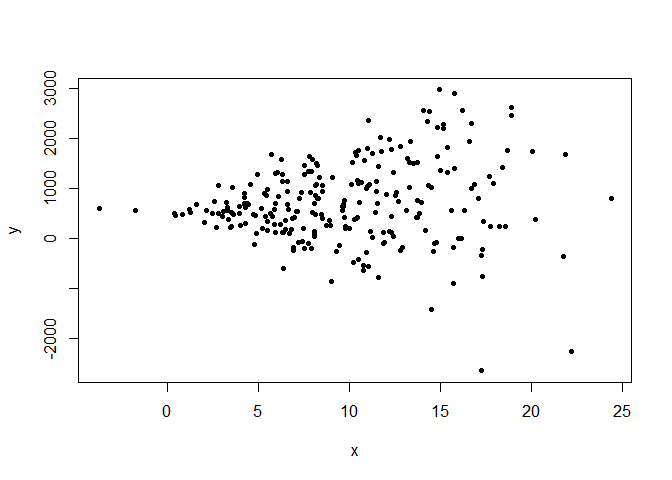
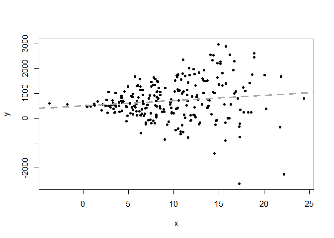
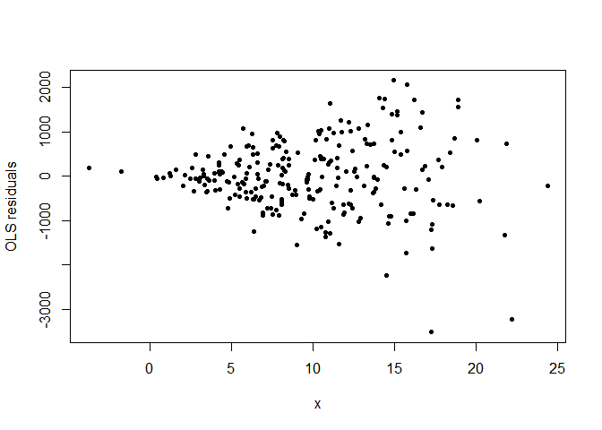

Understanding Heteroskedasticity
================

ECON 346, NEIU (Scott W. Hegerty)

Heteroskedasticity means “unequal variance.” In a regression, this
involves the error term being correlated with one or more of the
regressors. In this example, we generate a series where the variance
increases with *x*, and then show how the regression output differs when
**robust standard errors** are used. Standard OLS can give misleading
standard errors that can lead to incorrect inferences.

We begin by generating 250 observations of randomly-distributed data.
Variable *x* has a mean of 10 and a standard deviation of 5.

``` r
set.seed(25)
x<-rnorm(250,10,5)
head(x)
```

    ## [1]  8.940832  4.792044  4.233462 11.607657  2.499351  7.772334

We make a new variable, *y = 500 + 20x + e*. Unlike in other examples,
however, the error term *e* is a function of *x*. As *x* increases, so
does *e*. As a result, *y* "fans out’ in the scatterplot.

``` r
y<-500+20*x+.1*x*rnorm(250,0,750)
plot(x,y,pch=20)
```

<!-- -->

We can run a standard OLS regression–not taking heteroskedasticity into
account–and look at the results.

``` r
reg1<-lm(y~x)
summary(reg1)
```

    ## 
    ## Call:
    ## lm(formula = y ~ x)
    ## 
    ## Residuals:
    ##     Min      1Q  Median      3Q     Max 
    ## -3513.0  -455.5   -23.7   447.6  2153.5 
    ## 
    ## Coefficients:
    ##             Estimate Std. Error t value Pr(>|t|)    
    ## (Intercept)   507.62     111.52   4.552 8.33e-06 ***
    ## x              21.15      10.21   2.072   0.0393 *  
    ## ---
    ## Signif. codes:  0 '***' 0.001 '**' 0.01 '*' 0.05 '.' 0.1 ' ' 1
    ## 
    ## Residual standard error: 787.1 on 248 degrees of freedom
    ## Multiple R-squared:  0.01702,    Adjusted R-squared:  0.01305 
    ## F-statistic: 4.293 on 1 and 248 DF,  p-value: 0.0393

Both the intercept and *x* are significant at five percent.

Now, we can use *heteroskedasticity-consistent* standard errors. This
procedure applies an additional variance-covariance matrix into the
matrix calculations. This requires the *sandwich* and *lmtest* packages.
Here, using *HC1* for the formula matches Stata’s **robust** command.

``` r
library(sandwich)
library(lmtest)
```

    ## Loading required package: zoo

    ## 
    ## Attaching package: 'zoo'

    ## The following objects are masked from 'package:base':
    ## 
    ##     as.Date, as.Date.numeric

``` r
coeftest(reg1, vcov = vcovHC(reg1, type = "HC1"))
```

    ## 
    ## t test of coefficients:
    ## 
    ##             Estimate Std. Error t value  Pr(>|t|)    
    ## (Intercept)  507.617     96.038  5.2856 2.747e-07 ***
    ## x             21.152     12.482  1.6945   0.09143 .  
    ## ---
    ## Signif. codes:  0 '***' 0.001 '**' 0.01 '*' 0.05 '.' 0.1 ' ' 1

Now we see that *x* is no longer significant at 5 percent. The
coefficient “point” estimates are unchanged. In other words, the
presence of heteroskedasticity affects the significance of the estimates
(and can lead to the wrong conclusions!) but not the betas themselves.

As a final note, we can test for heteroskedasticity in our OLS
regression residuals. Let’s take a look at the original regression line:

``` r
plot(x,y,pch=20)
abline(reg1,lty=2,lwd=3,col="dark grey")
```

<!-- -->

Plotting the residuals shows them increasing with *x*.

``` r
plot(x, reg1$residuals, pch=20,ylab="OLS residuals")
```

<!-- -->

You can also do a formal Breusch-Pagan test for heteroskedasticity. It
regresses squared residuals on all the independent variables (as well as
the products of pairs of these variables). A test for joint significance
of all these terms in the regression is conducted–if one or more is
significant, the null hypotheses of no heteroskedascity is rejected,
because there is a relationship between some variable(s) and the error
term.

``` r
bptest(reg1)
```

    ## 
    ##  studentized Breusch-Pagan test
    ## 
    ## data:  reg1
    ## BP = 40.042, df = 1, p-value = 2.486e-10

The low p-value shows that the null is rejected. There is definitely
heteroskedasticity, and this confirms the visual evidence.
