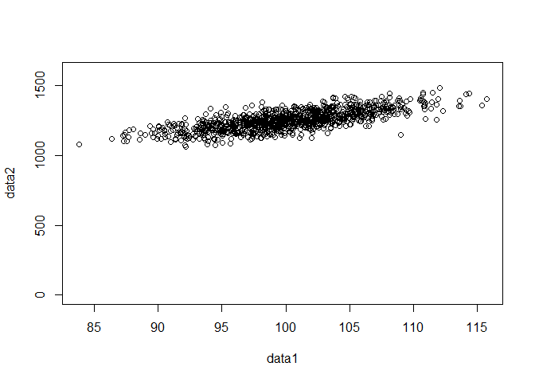
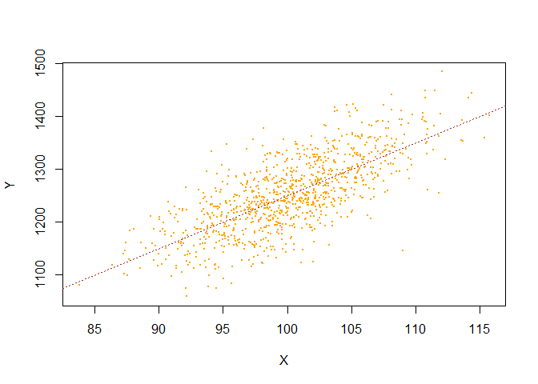
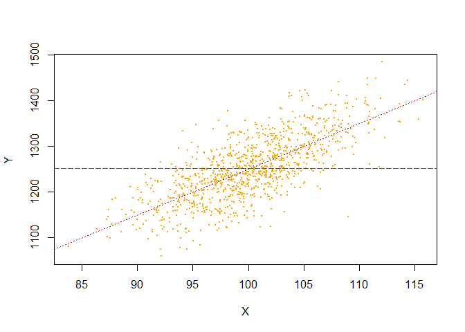

Understanding Regression Analysis
================

The example matches a regression run using the base R command with one
that uses linear algebra (also in R). We can calculate the beta
coefficients, standard errors, t-statistics, and R-squared. It shows how
the theory is applied to some generated data.

First, we generate 1000 observations of randomly distributed data. Note
the mean and standard deviation of the dataset.

``` r
data1<-rnorm(1000,mean=100,sd=5)
head(data1)
```

    ## [1] 103.63519  99.50546  92.89883  99.31087  93.25478 105.87063

Next, we generate 1000 observations for *Y* based on *Y = 250 + 10X + e*
.

``` r
data2<-250+10*data1+rnorm(1000,mean=0,sd=50)
plot(data1,data2,ylim=c(0,1600))
```

<!-- -->

We see a linear relationship, with variation added.

We can make a dataframe, and the plot the data, adding a regression
line. The formula for the regression is the “linear model,” or *lm()*. I
adjust the pointsize and color, as well as the line types and widths.

``` r
dataset<-as.data.frame(cbind(data1,data2))
colnames(dataset)<-c("X","Y")
plot(dataset,pch=20,cex=.4,col="orange")
abline(lm(dataset$Y~dataset$X),lty=3,col="brown",lwd=.8)
```

<!-- -->

Both the intercept and *x* are highly significant (and positive).

We can formally calculate a bivariate regression and report its results
using the *summary()* command.

``` r
reg1<-lm(dataset$Y~dataset$X)
summary(reg1)
```

    ## 
    ## Call:
    ## lm(formula = dataset$Y ~ dataset$X)
    ## 
    ## Residuals:
    ##      Min       1Q   Median       3Q      Max 
    ## -195.310  -31.953    0.285   33.835  146.174 
    ## 
    ## Coefficients:
    ##             Estimate Std. Error t value Pr(>|t|)    
    ## (Intercept) 249.1195    30.4573   8.179 8.62e-16 ***
    ## dataset$X    10.0114     0.3037  32.965  < 2e-16 ***
    ## ---
    ## Signif. codes:  0 '***' 0.001 '**' 0.01 '*' 0.05 '.' 0.1 ' ' 1
    ## 
    ## Residual standard error: 48.48 on 998 degrees of freedom
    ## Multiple R-squared:  0.5213, Adjusted R-squared:  0.5208 
    ## F-statistic:  1087 on 1 and 998 DF,  p-value: < 2.2e-16

We can also the regression “by hand” using matrix algebra: The estimated
coefficients are the well-known Beta = (X’X)-1\*(X’Y).

We have to make sure we use a matrix, and to make it a matrix if
necessary. Note that I add a column of 1s; this will be used to get the
intercept. The formulas for transposing and multiplying matrices are
below.

As I always note, this is the “medium way.” The “hard way” would involve
you inverting a matrix with a pencil and paper!

``` r
regdata<-cbind(rep(1,nrow(dataset)),dataset)
is.matrix(regdata)
```

    ## [1] FALSE

``` r
regdata<-as.matrix(regdata)
```

``` r
X<-regdata[,1:2]
colnames(X)[1]<-"Constant"
Y<-regdata[,3]
betas<-solve(t(X)%*%X)%*%t(X)%*%Y
betas
```

    ##               [,1]
    ## Constant 249.11954
    ## X         10.01144

The betas calculated here match the *lm()* results.

    ## (Intercept)   dataset$X 
    ##   249.11954    10.01144

Next, we calculate predicted value: The matrix formula is *X\*beta* :

``` r
yhat<-X%*%betas
head(yhat)
```

    ##          [,1]
    ## [1,] 1286.657
    ## [2,] 1245.313
    ## [3,] 1179.171
    ## [4,] 1243.365
    ## [5,] 1182.734
    ## [6,] 1309.037

We can also calculate the residuals. These should be centered around
zero.

``` r
resid<-Y-yhat
head(resid)
```

    ##           [,1]
    ## [1,] -43.19059
    ## [2,]  32.48037
    ## [3,] -36.20719
    ## [4,] -46.70773
    ## [5,] -24.87637
    ## [6,] -31.65959

We can calculate the Residual Sum of Squares (RSS) and the Explained Sum
of Squares (ESS); the sum is Total (TSS). This gives us R squared,
calculated here as *ESS/TSS*. (The notation sometimes differs in a
confusing way!)

``` r
RSS<-t(resid)%*%resid
ESS<-sum((yhat-mean(Y))^2)
R2<-ESS/(RSS+ESS)
R2
```

    ##           [,1]
    ## [1,] 0.5212657

We can also use *RSS* to get the standard error of the regression. This
is calculated using matrix algebra as *e’e/(N-k)*.

``` r
S2<-RSS/(length(Y)-ncol(X))
S2
```

    ##          [,1]
    ## [1,] 2350.014

This can be used to make a Make a Variance-Covariance Matrix. It is 3x3
in this case, with variances on the diagonals and covariances on the
off-diagonals.

``` r
vcovmatrix<-sqrt(solve(t(X)%*%X)*as.numeric(S2))
```

    ## Warning in sqrt(solve(t(X) %*% X) * as.numeric(S2)): NaNs produced

``` r
vcovmatrix
```

    ##          Constant        X
    ## Constant 30.45728      NaN
    ## X             NaN 0.303703

We use this matrix to make the coefficient standard errors and the
corresponding t-statistics.

``` r
se<-diag(vcovmatrix)
tstat<-betas/se
tstat
```

    ##               [,1]
    ## Constant  8.179311
    ## X        32.964585

We can also make a nice table.

``` r
table<-round(cbind(betas,se,tstat),3)
table<-rbind(table,c(round(R2,3),"",""))
colnames(table)<-c("Beta","SE","T")
rownames(table)[3]<-"R2"
noquote(table)
```

    ##          Beta   SE     T     
    ## Constant 249.12 30.457 8.179 
    ## X        10.011 0.304  32.965
    ## R2       0.521

Check the R output: They match!

    ## 
    ## Call:
    ## lm(formula = dataset$Y ~ dataset$X)
    ## 
    ## Residuals:
    ##      Min       1Q   Median       3Q      Max 
    ## -195.310  -31.953    0.285   33.835  146.174 
    ## 
    ## Coefficients:
    ##             Estimate Std. Error t value Pr(>|t|)    
    ## (Intercept) 249.1195    30.4573   8.179 8.62e-16 ***
    ## dataset$X    10.0114     0.3037  32.965  < 2e-16 ***
    ## ---
    ## Signif. codes:  0 '***' 0.001 '**' 0.01 '*' 0.05 '.' 0.1 ' ' 1
    ## 
    ## Residual standard error: 48.48 on 998 degrees of freedom
    ## Multiple R-squared:  0.5213, Adjusted R-squared:  0.5208 
    ## F-statistic:  1087 on 1 and 998 DF,  p-value: < 2.2e-16

You can also add the RSS to the regression and get the *Ybar* mean line
that is used elsewhere to explain regression analysis.

``` r
plot(dataset,pch=20,cex=.4,col="orange")
abline(lm(dataset$Y~dataset$X),lty=3,col="brown",lwd=.8)
abline(h=mean(Y),col="red",lty=5,lwd=0.6)
```

<!-- -->
